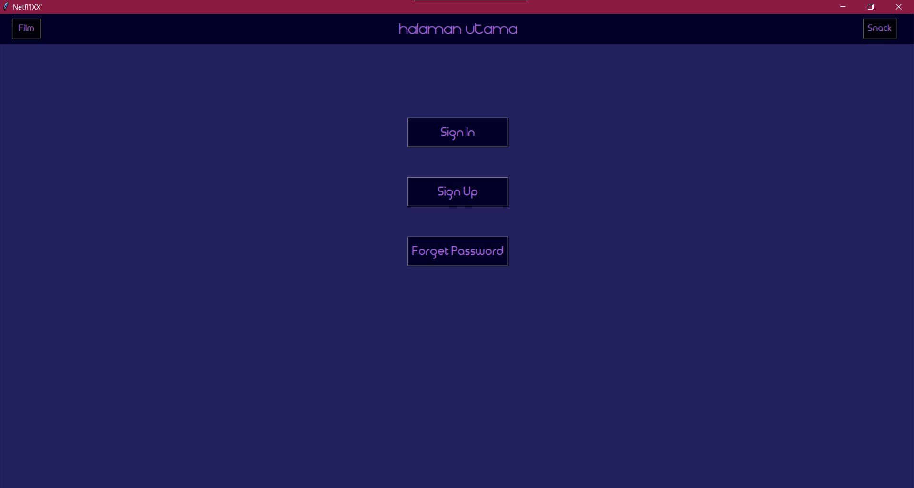
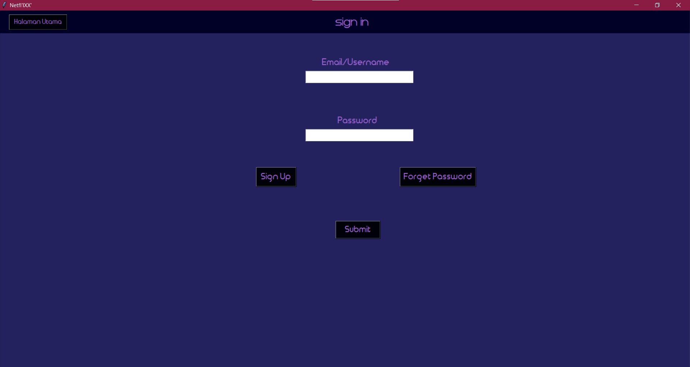
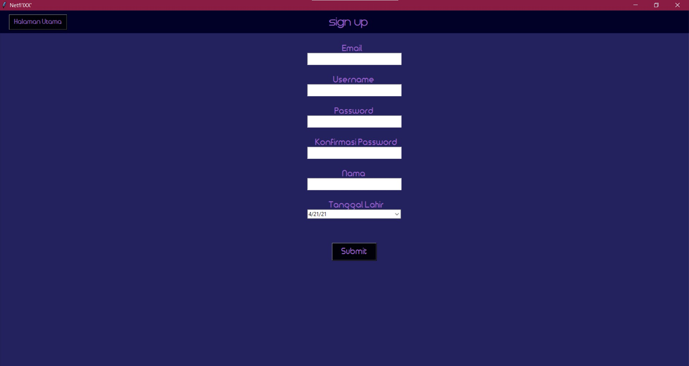
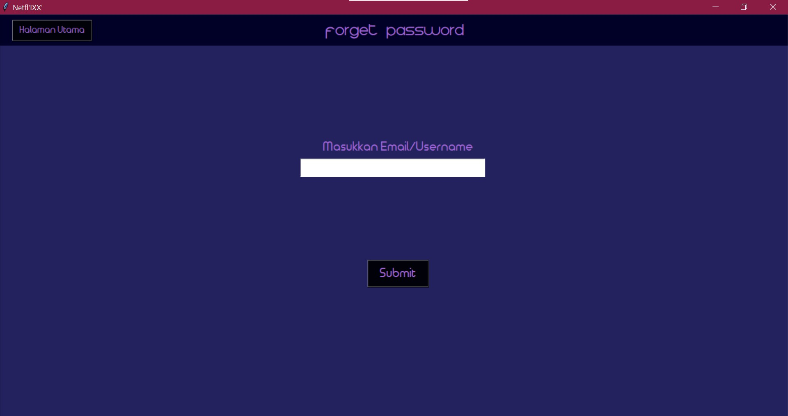

# Netfl'IXX'
Aplikasi untuk menonton film bernama Netfl'IXX' yang memanfaatkan konsep prosedural dan bahasa pemrograman Python untuk implementasinya. Aplikasi ini dibuat untuk memenuhi tugas besar IF2250 - Rekayasa Perangkat Lunak

# Cara Menjalankan Program
## Prerequisite
- Minimal [Python 3](https://www.python.org/downloads/)
- [Tkinter](https://www.tutorialspoint.com/how-to-install-tkinter-in-python)
- [Yagmail](https://pypi.org/project/yagmail/)
- [Numpy](https://numpy.org/install/)

## Menjalankan Program
1. Clone project ini
2. Masuk ke dalam _directory_ src
`cd src`
3. Jalankan `python main.py`

# Daftar Modul
## Pembagian Modul
| Nama modul      |    NIM   | Nama                          |
| --------------- |:--------:| :-----------------------------|
| Film            | 13519148 | Muhammad Atthaumar Rifqy      |
| Review          | 13519159 | Benidictus Galih Mahar Putra  |
| Update Database | 13519137 | Siti Iedrania Azzariyat Akbar |
| User            | 13519118 | Cynthia Rusadi                |

## Tampilan Layar
### Halaman Utama

### Film

### Review

### Update Database

### User

")
")

# Basis Data
